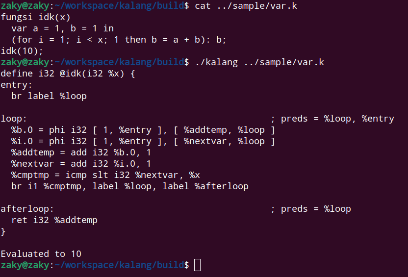
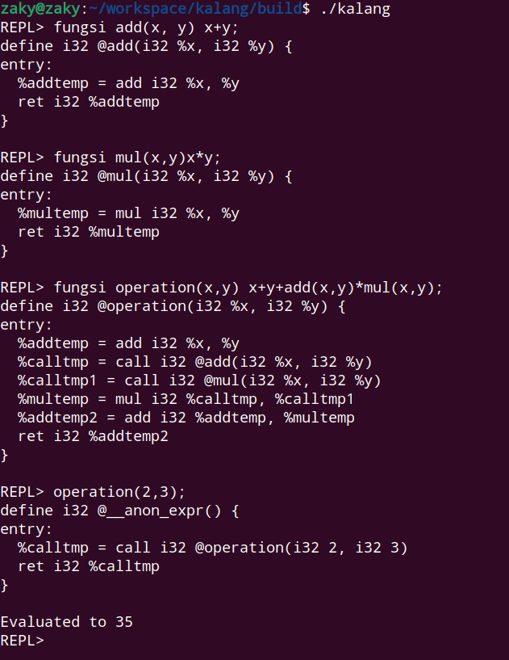
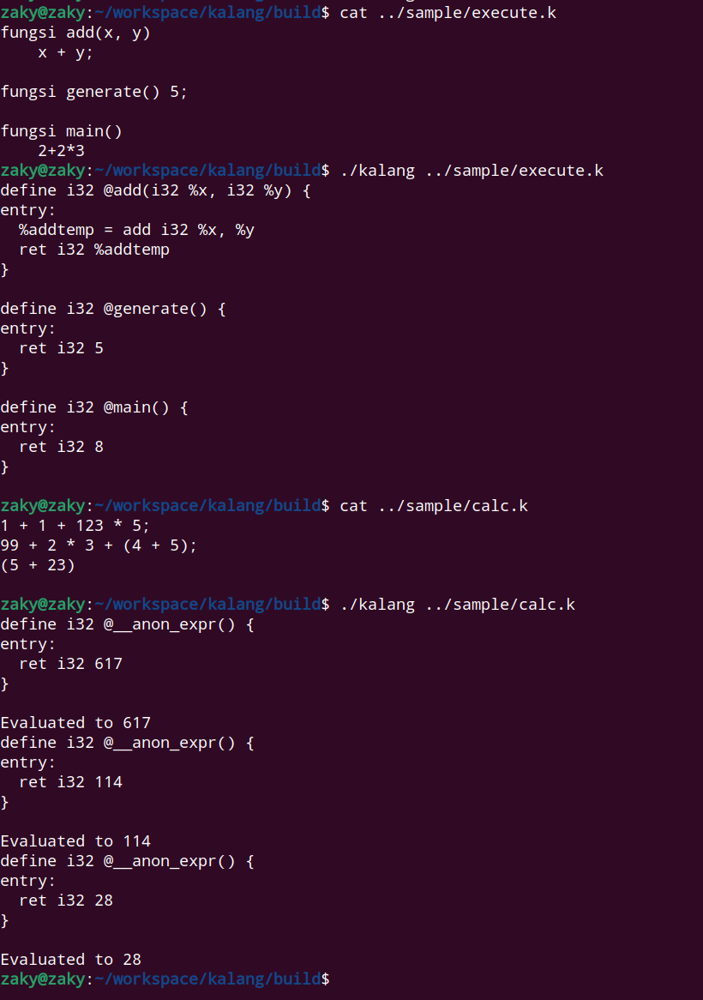

kalang
=====

Kalang (dibaca kaleng), adalah sebuah bahasa pemrograman

Features:
* Function
* Just In Time Execution
* Mutable variables
* if-else
* operators: +, -, *, <
* Optimizations

dependency: LLVM-14
how to build:
0. clone this repository, and change current directory to kalang
1. `mkdir build`
2. `cd build`
3. `sudo cmake ..`
4. `sudo make`
5. `./kalang [path]` (just `./kalang` to interact with REPL)

This compiler will emit LLVM IR in dump.ll

use `clang dump.ll` to compile into executable

you can see the generated assembly with objdump or gdb

Make sure to have main function if you want to compile it to executable with clang

REPL:

File:

